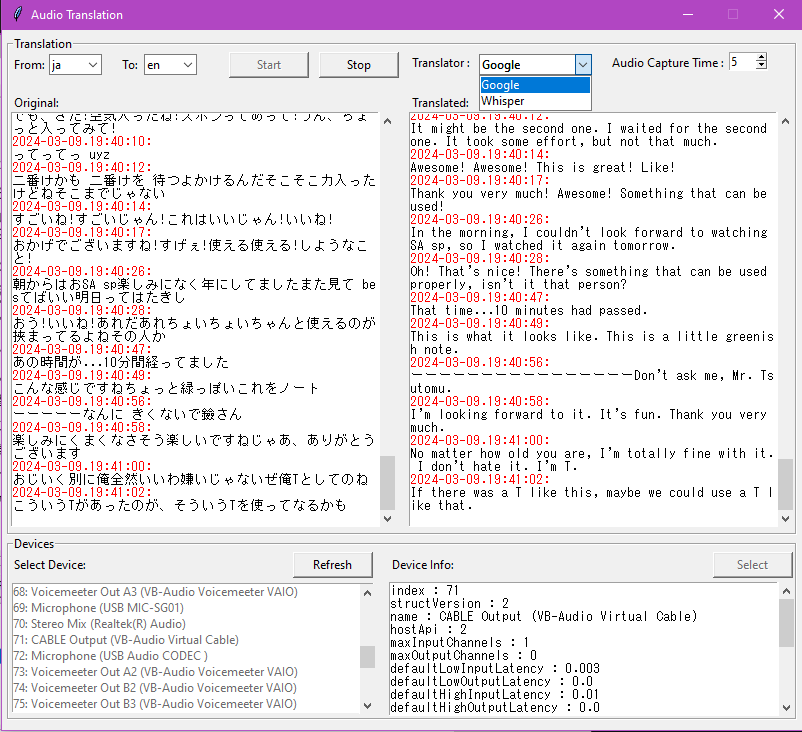

# RealtimeAudioTranslation
 
Uses PyAudio, Google Translate, and OpenAi Whisper to capture computer audio and translate in "real time" (there is a delay between capture and display).

To capture computer audio, a loopback system is needed to feed audio into an input for pyaudio to record. A virtual audio cable (eg. VB Audio) can be used to create a loopback to capture from.

**Note: Google translate does not translate 100% accurately, but translator can be swapped in the future.

To Use:
----
Run Main.py file to start program. 

Select the loopback device that can be captured from and press start.

**Note: The initial start may take a little bit of time to start showing translation