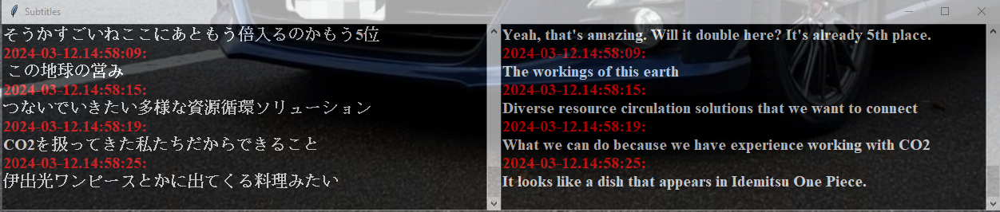

# Realtime Audio Translation
 
Uses PyAudio, deep-translator, and [faster-whisper](https://github.com/SYSTRAN/faster-whisper) (GPU cuda processing) to capture computer audio and translate in "real time" (there is a delay between capture and display).

To capture computer audio, a loopback system in 1 channel (for whisper) is needed to feed audio into an input for pyaudio to record. A virtual audio cable (eg. VB Audio) can be used to create a loopback to capture from.

Currently translating Japanese to English and vice versa supported.

To Use:
----
Faster-whisper with GPU requires the installation of [cuBLAS](https://developer.nvidia.com/cublas) and [cuDNN8](https://developer.nvidia.com/cudnn)
(or grab from Purview's repository [here](https://github.com/Purfview/whisper-standalone-win/releases/tag/libs), however the the cuBLAS 12 is needed so downloading from above is still needed.)
Python 3.8.0 minimum required and the following packages:

```
pip install faster-whisper
pip install pyaudio
pip install deep-translator
pip install scipy
pip install torch
```

Run Main.py file to start program. 

Select the loopback device that can be captured from and press start.


**Note: The initial start may take a little bit of time to start showing translation

Updates:
----
**2024-03-11**
- Support for DeepL Translator (Requires generating your own API key)
- Switch from original Whisper package to faster-whisper package
    - Speed of transcription has increased from the switch.

**2024-03-12**
- Omit converting to wav and send audio data directly to faster-whisper
- New pop out semi-transparent window to act as subtitles.



Future:
----
- [ ] Support for more translators/languages (Api Keys required when needed)
    - [x] DeepL Translation
- [x] Switch to faster-whisper (voice detection using Silero VAD)
- [x] Directly connect pyaudio to faster-whisper and omit converting to wav(?)
